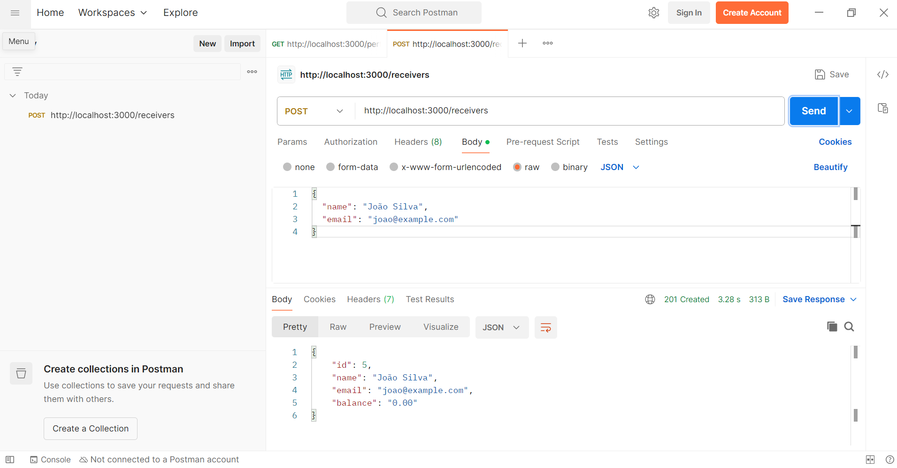
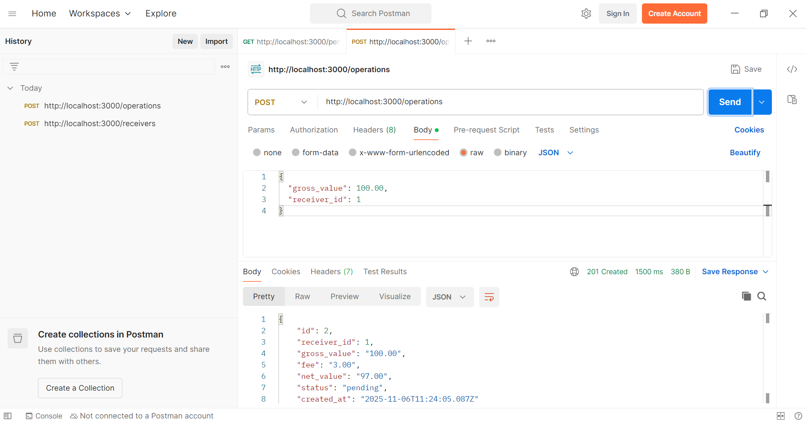
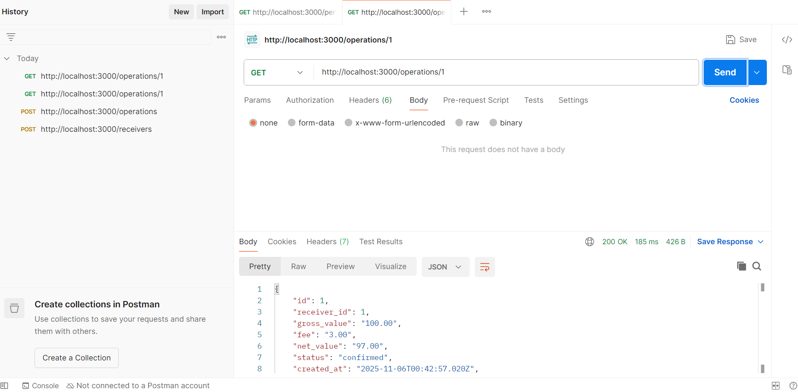
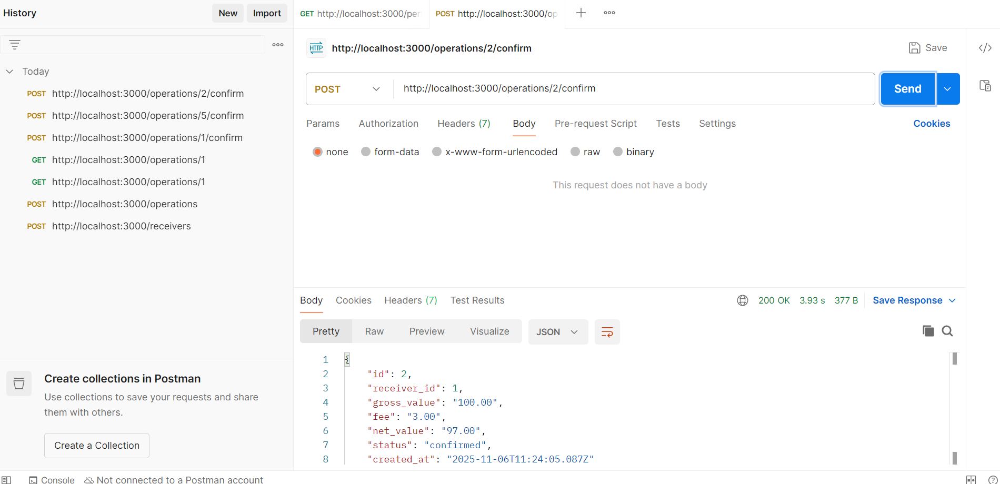
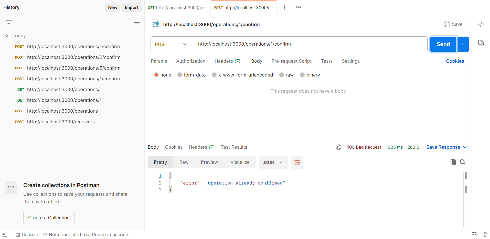
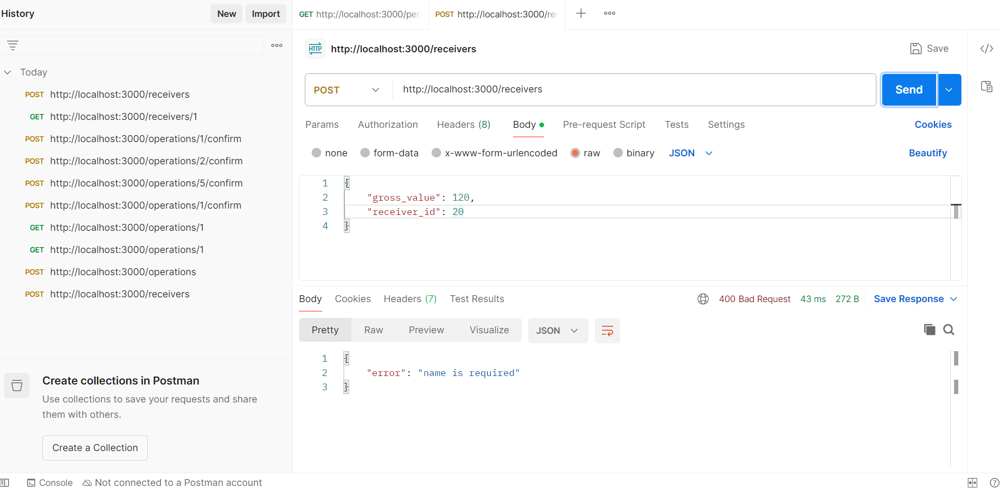
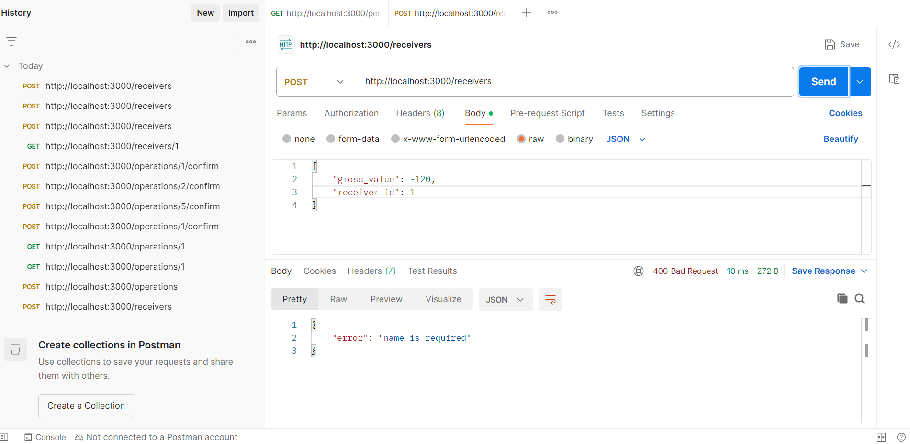
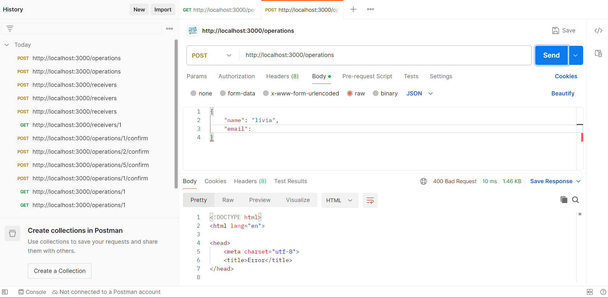

# LocPay Tech Challenge - Summer Job 2025 - Lívia Cavalcanti Oliveira

## Sobre o Projeto

API REST para processamento de pagamentos desenvolvida com Node.js, Express e SQLite. O sistema permite criar recebedores, registrar operações com taxas automáticas e confirmar transações atualizando saldos.

## Processo de Desenvolvimento

### 1. Setup Inicial
- Criação do projeto Express
- Configuração do banco SQLite
- Estruturação das rotas básicas

### 2. Implementação do Banco
- Modelagem das tabelas:
  - receivers (id, name, email, balance)
  - operations (id, receiver_id, gross_value, fee, net_value, status)
- Implementação das queries SQL
- Sistema de migrations para criar/atualizar tabelas

### 3. Desenvolvimento das Rotas

#### Receivers
- POST /receivers
  - Criação de recebedores com saldo inicial 0
  - Validação de campos obrigatórios
  

#### Operations  
- POST /operations
  - Cálculo automático da taxa (3%)
  - Validação de valores e receiver_id
  

- GET /operations/:id
  - Consulta detalhada incluindo dados do recebedor
  

- POST /operations/:id/confirm
  - Sistema de transações para garantir consistência
  - Atualização do saldo do recebedor
  

### 4. Testes e Validações

#### Fluxo de Testes
1. Criar recebedor (POST /receivers)
   - Request: `{"name": "João Silva", "email": "joao@example.com"}`
   - Response: Recebedor criado com id e balance = 0

2. Criar operação (POST /operations)
   - Request: `{"gross_value": 100.00, "receiver_id": 1}`
   - Response: Operação criada com fee = 3.00 e net_value = 97.00

3. Confirmar operação (POST /operations/:id/confirm)
   - Request: Sem body
   - Response: Operação atualizada para status "confirmed"

4. Verificar saldo (GET /receivers/:id)
   - Response: Recebedor com balance atualizado (97.00)

#### Cenários de Erro Testados
- Tentativa de confirmar operação já confirmada

- Criação de operação com receiver_id inexistente

- Valores negativos ou inválidos

- Campos obrigatórios ausentes

## Tecnologias Utilizadas

- Node.js & Express para API REST
- SQLite para persistência local
- Postman para testes de API
